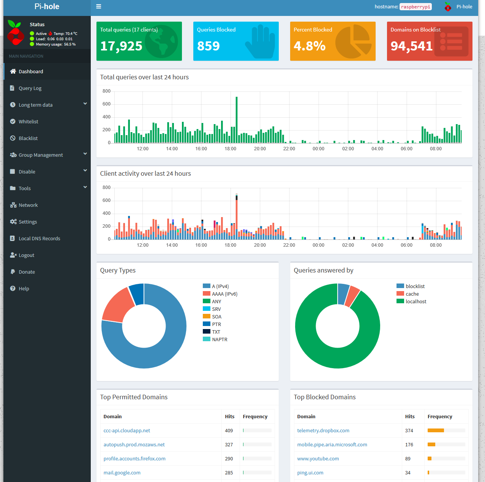

# (Ab)use of DNS

Translating your Domains into IP Addresses...
and more.

---
## What is DNS?

- Hierarchical system of names
- Decentralized

---


---
## `.`

- The "root" of DNS
- Overseen by Internet Corporation for Assigned Names and Numbers (ICANN)
- "13" Name Servers
- More than that due to [anycast](https://en.wikipedia.org/wiki/Anycast)
- Contains the Nameservers for Top Level Domains (TLDs)

---
## Nameservers for `com.`

```
$ dig NS com.
;; QUESTION SECTION:
;com.                           IN      NS

;; ANSWER SECTION:
com.                    171845  IN      NS      j.gtld-servers.net.
com.                    171845  IN      NS      i.gtld-servers.net.
com.                    171845  IN      NS      f.gtld-servers.net.
com.                    171845  IN      NS      a.gtld-servers.net.
com.                    171845  IN      NS      l.gtld-servers.net.
com.                    171845  IN      NS      g.gtld-servers.net.
com.                    171845  IN      NS      k.gtld-servers.net.
com.                    171845  IN      NS      h.gtld-servers.net.
com.                    171845  IN      NS      m.gtld-servers.net.
com.                    171845  IN      NS      b.gtld-servers.net.
com.                    171845  IN      NS      e.gtld-servers.net.
com.                    171845  IN      NS      c.gtld-servers.net.
com.                    171845  IN      NS      d.gtld-servers.net.

;; ADDITIONAL SECTION:
c.gtld-servers.net.     85436   IN      A       192.26.92.30
d.gtld-servers.net.     85436   IN      A       192.31.80.30
j.gtld-servers.net.     85436   IN      A       192.48.79.30
i.gtld-servers.net.     85436   IN      A       192.43.172.30
f.gtld-servers.net.     85436   IN      A       192.35.51.30
a.gtld-servers.net.     85436   IN      A       192.5.6.30
l.gtld-servers.net.     85437   IN      A       192.41.162.30
g.gtld-servers.net.     85436   IN      A       192.42.93.30
k.gtld-servers.net.     85437   IN      A       192.52.178.30
h.gtld-servers.net.     85436   IN      A       192.54.112.30
m.gtld-servers.net.     85437   IN      A       192.55.83.30
b.gtld-servers.net.     85436   IN      A       192.33.14.30
e.gtld-servers.net.     85436   IN      A       192.12.94.30
```
---
## Fully Qualified Domain Name [(FQDN)](https://en.wikipedia.org/wiki/Fully_qualified_domain_name)

- Technically `basis-ai.com` is really `basis-ai.com.`

```
$ dig basis-ai.com

;; OPT PSEUDOSECTION:
; EDNS: version: 0, flags:; udp: 512
;; QUESTION SECTION:
;basis-ai.com.                  IN      A

;; ANSWER SECTION:
basis-ai.com.           300     IN      A       35.244.177.213
```

- Resolvers usually add the `.` for you or some local default (e.g. local service discovery)

---
## YouTube Advertisement Blocking

- Visit `www.youtube.com.` instead!


[Source](https://www.reddit.com/r/webdev/comments/gzr3cq/fyi_you_can_bypass_youtube_ads_by_adding_a_dot/)

- Not sure if this is a bug in CORS implementation,
- or actually from the specification. 🤷🏻‍♂️

---

## DNS Architecture

- Decentralised Name Servers
- Starts from the root
- Parent layer will contain NS record for the child layer

---
### `.`

```
$ dig +noall +answer NS .
.                       494556  IN      NS      h.root-servers.net.
.                       494556  IN      NS      e.root-servers.net.
.                       494556  IN      NS      j.root-servers.net.
.                       494556  IN      NS      i.root-servers.net.
.                       494556  IN      NS      f.root-servers.net.
.                       494556  IN      NS      b.root-servers.net.
.                       494556  IN      NS      m.root-servers.net.
.                       494556  IN      NS      l.root-servers.net.
.                       494556  IN      NS      d.root-servers.net.
.                       494556  IN      NS      k.root-servers.net.
.                       494556  IN      NS      a.root-servers.net.
.                       494556  IN      NS      g.root-servers.net.
.                       494556  IN      NS      c.root-servers.net.

b.root-servers.net.     75913   IN      A       199.9.14.201
b.root-servers.net.     113885  IN      AAAA    2001:500:200::b
m.root-servers.net.     73453   IN      A       202.12.27.33
m.root-servers.net.     73453   IN      AAAA    2001:dc3::35
l.root-servers.net.     102000  IN      A       199.7.83.42
l.root-servers.net.     113885  IN      AAAA    2001:500:9f::42
d.root-servers.net.     94581   IN      A       199.7.91.13
d.root-servers.net.     113885  IN      AAAA    2001:500:2d::d
k.root-servers.net.     100634  IN      A       193.0.14.129
k.root-servers.net.     113885  IN      AAAA    2001:7fd::1
a.root-servers.net.     73415   IN      A       198.41.0.4
a.root-servers.net.     74384   IN      AAAA    2001:503:ba3e::2:30
g.root-servers.net.     102000  IN      A       192.112.36.4
g.root-servers.net.     113885  IN      AAAA    2001:500:12::d0d
c.root-servers.net.     79345   IN      A       192.33.4.12
c.root-servers.net.     113885  IN      AAAA    2001:500:2::c
h.root-servers.net.     102000  IN      A       198.97.190.53
h.root-servers.net.     113885  IN      AAAA    2001:500:1::53
e.root-servers.net.     99652   IN      A       192.203.230.10
e.root-servers.net.     113885  IN      AAAA    2001:500:a8::e
j.root-servers.net.     80188   IN      A       192.58.128.30
j.root-servers.net.     113885  IN      AAAA    2001:503:c27::2:30
i.root-servers.net.     102000  IN      A       192.36.148.17
i.root-servers.net.     113885  IN      AAAA    2001:7fe::53
f.root-servers.net.     102000  IN      A       192.5.5.241
f.root-servers.net.     113891  IN      AAAA    2001:500:2f::f
```
---
### `.com.`

```
$ dig +noall +answer NS basis-ai.com.
basis-ai.com.           21600   IN      NS      ns-cloud-a4.googledomains.com.
basis-ai.com.           21600   IN      NS      ns-cloud-a1.googledomains.com.
basis-ai.com.           21600   IN      NS      ns-cloud-a2.googledomains.com.
basis-ai.com.           21600   IN      NS      ns-cloud-a3.googledomains.com.
```

---
### `basis-ai.com.`

```
$ dig NS bedrock.basis-ai.com

;; QUESTION SECTION:
;bedrock.basis-ai.com.          IN      NS

;; ANSWER SECTION:
bedrock.basis-ai.com.   21600   IN      NS      ns-cloud-c2.googledomains.com.
bedrock.basis-ai.com.   21600   IN      NS      ns-cloud-c3.googledomains.com.
bedrock.basis-ai.com.   21600   IN      NS      ns-cloud-c4.googledomains.com.
bedrock.basis-ai.com.   21600   IN      NS      ns-cloud-c1.googledomains.com.

;; ADDITIONAL SECTION:
ns-cloud-c1.googledomains.com. 297122 IN A      216.239.32.108
ns-cloud-c1.googledomains.com. 298185 IN AAAA   2001:4860:4802:32::6c
ns-cloud-c2.googledomains.com. 297126 IN A      216.239.34.108
ns-cloud-c2.googledomains.com. 298296 IN AAAA   2001:4860:4802:34::6c
ns-cloud-c3.googledomains.com. 297156 IN A      216.239.36.108
ns-cloud-c3.googledomains.com. 298253 IN AAAA   2001:4860:4802:36::6c
ns-cloud-c4.googledomains.com. 296994 IN A      216.239.38.108
ns-cloud-c4.googledomains.com. 298327 IN AAAA   2001:4860:4802:38::6c
```

---
### `bedrock.basis-ai.com`

```
$ dig bedrock.basis-ai.com

;; QUESTION SECTION:
;bedrock.basis-ai.com.          IN      A

;; ANSWER SECTION:
bedrock.basis-ai.com.   300     IN      A       35.240.210.204
```
---

## Types of DNS Records -`A` and `AAAA`

```
$ dig www.google.com

;; QUESTION SECTION:
;www.google.com.                        IN      A

;; ANSWER SECTION:
www.google.com.         114     IN      A       172.217.194.105
www.google.com.         114     IN      A       172.217.194.99
www.google.com.         114     IN      A       172.217.194.106
www.google.com.         114     IN      A       172.217.194.103
www.google.com.         114     IN      A       172.217.194.147
www.google.com.         114     IN      A       172.217.194.104

$ dig AAAA www.google.com

;; QUESTION SECTION:
;www.google.com.                        IN      AAAA

;; ANSWER SECTION:
www.google.com.         109     IN      AAAA    2404:6800:4003:c04::69

```

---
## Types of DNS Records - `MX`

```
$ dig MX basis-ai.com

; <<>> DiG 9.11.3-1ubuntu1.12-Ubuntu <<>> MX basis-ai.com
;; global options: +cmd
;; Got answer:
;; ->>HEADER<<- opcode: QUERY, status: NOERROR, id: 63394
;; flags: qr rd ra; QUERY: 1, ANSWER: 5, AUTHORITY: 0, ADDITIONAL: 3

;; OPT PSEUDOSECTION:
; EDNS: version: 0, flags:; udp: 512
;; QUESTION SECTION:
;basis-ai.com.                  IN      MX

;; ANSWER SECTION:
basis-ai.com.           3600    IN      MX      5 alt2.aspmx.l.google.com.
basis-ai.com.           3600    IN      MX      10 alt3.aspmx.l.google.com.
basis-ai.com.           3600    IN      MX      10 alt4.aspmx.l.google.com.
basis-ai.com.           3600    IN      MX      1 aspmx.l.google.com.
basis-ai.com.           3600    IN      MX      5 alt1.aspmx.l.google.com.

;; ADDITIONAL SECTION:
aspmx.l.google.com.     195     IN      A       74.125.24.26
aspmx.l.google.com.     195     IN      AAAA    2404:6800:4003:c04::1a
```

---
## Types of DNS Records - `CNAME`

```
$ dig auth.basis-ai.com

;; QUESTION SECTION:
;auth.basis-ai.com.             IN      A

;; ANSWER SECTION:
auth.basis-ai.com.      3600    IN      CNAME   bdrk-cd-cm6eaqua5yzksmql.edge.tenants.auth0.com.
bdrk-cd-cm6eaqua5yzksmql.edge.tenants.auth0.com. 300 IN CNAME tenants.auth0.com.
tenants.auth0.com.      60      IN      A       54.71.132.32
tenants.auth0.com.      60      IN      A       44.228.7.2
tenants.auth0.com.      60      IN      A       52.12.28.200

```

---
## Types of DNS Records - `CAA`

```
$ dig CAA auth.basis-ai.com

;; QUESTION SECTION:
;auth.basis-ai.com.             IN      CAA

;; ANSWER SECTION:
auth.basis-ai.com.      3568    IN      CNAME   bdrk-cd-cm6eaqua5yzksmql.edge.tenants.auth0.com.
bdrk-cd-cm6eaqua5yzksmql.edge.tenants.auth0.com. 268 IN CNAME tenants.auth0.com.
tenants.auth0.com.      60      IN      CAA     0 issue "letsencrypt.org"
tenants.auth0.com.      60      IN      CAA     0 issue "amazon.com"
tenants.auth0.com.      60      IN      CAA     0 issue "amazonaws.com"
tenants.auth0.com.      60      IN      CAA     0 issue "amazontrust.com"
tenants.auth0.com.      60      IN      CAA     0 issue "awstrust.com"
tenants.auth0.com.      60      IN      CAA     0 issue "comodoca.com"
```

---
## Types of DNS Records - `TXT` aka master of (Ab)use

```bash
# Demonstrate domain control
$ dig TXT basis-ai.com

;; OPT PSEUDOSECTION:
; EDNS: version: 0, flags:; udp: 512
;; QUESTION SECTION:
;basis-ai.com.                  IN      TXT

;; ANSWER SECTION:
basis-ai.com.           3600    IN      TXT     "google-site-verification=80hiIqAESYhPJXpCUhzij24RjxOVWjRoWNguO6UTWA8"
basis-ai.com.           3600    IN      TXT     "google-site-verification=lTJdfZNdjSedLBKIOxoJeBsECEIYN2HpS89GuZ-yA2Y"
basis-ai.com.           3600    IN      TXT     "v=spf1 include:_spf.google.com include:sendgrid.net include:4788637.spf03.hubspotemail.net ~all"
```

---
## `TXT` (Ab)use - DMARC

- System of using DNS Records to validate who is allowed to send email as the domain

### [`spf`](https://en.wikipedia.org/wiki/Sender_Policy_Framework)

- Allowed list of email server addresses to send emails from

```
basis-ai.com.           3600    IN      TXT     "v=spf1 include:_spf.google.com include:sendgrid.net include:4788637.spf03.hubspotemail.net ~all"
```

---
## `TXT` (Ab)use - DMARC

### DKIM

- Lists public keys to verify email signatures
- Emails will specify a "selector" for the key being used

```
$ dig TXT google._domainkey.basis-ai.com

;; QUESTION SECTION:
;google._domainkey.basis-ai.com.        IN      TXT

;; ANSWER SECTION:
google._domainkey.basis-ai.com. 3600 IN TXT     "v=DKIM1;" "k=rsa;"
"p=MIGfMA0GCSqGSIb3DQEBAQUAA4GNADCBiQKBgQCaJeDDAhBDSP0H1DiYu1aqMM12v1pXdpc0//eW/
bttioNKsVfHnOcrIkAchBOiJF2KTmLGVNFzNbvTNS7eOGn4Vre82jeXpx9SDgu5DxbU3OK6jO7tnT3HnybqGivcRbtr1YXfWKWOSdySoKxZXU1PlH95IFUJRVU3337H/OYW+QIDAQAB"
```

---
## `TXT` (Ab)use - DMARC

- DMARC policy tells recipients what to do with suspicious emails that fail either SPF or DKIM checks

```
$ dig TXT _dmarc.basis-ai.com

;; QUESTION SECTION:
;_dmarc.basis-ai.com.           IN      TXT

;; ANSWER SECTION:
_dmarc.basis-ai.com.    3600    IN      TXT     "v=DMARC1;" "p=quarantine;" "sp=reject;" "adkim=s;"
"aspf=r;" "rua=mailto:dmarc@basis-ai.com,mailto:awjeb3c7@ag.ap.dmarcian.com"
```

[Read more](https://www.dmarcanalyzer.com/how-to-create-a-dmarc-record/)

---
## Resolving

- Sending DNS Queries to a DNS Server, usually on port 53
- When you connect to your network, your gateway's DHCP server usually sets itself as the DNS server
- Your Gateway will then use the DNS server assigned to it by your ISP DHCP

### DNS Caching

- Results are cached with a TTL
- Updates to Nameservers will take time to propogate.

---
## DNS Usage - Censorship!

```
# Ashley Madison
$ dig @dnssec1.singnet.com.sg www.amson.icu

;; QUESTION SECTION:
;www.amson.icu.                 IN      A

$ dig @8.8.8.8 www.amson.icu

;; QUESTION SECTION:
;www.amson.icu.                 IN      A

;; ANSWER SECTION:
www.amson.icu.          1798    IN      A       192.64.119.168
```

---
## DNS Usage - Censorship!

- Even more nefarious in Indonesia!
- Packet sniffing will intercept and hijack plaintext DNS requests to `8.8.8.8`!
- Use DNS over TLS (DOT) or DNS over HTTPS (DOH)

---
## DNS Usage - Ad blocking with [Pi-hole](https://pi-hole.net/)

```
$ dig @8.8.8.8 js.hs-analytics.net

;; QUESTION SECTION:
;js.hs-analytics.net.           IN      A

;; ANSWER SECTION:
js.hs-analytics.net.    286     IN      A       104.17.67.176
js.hs-analytics.net.    286     IN      A       104.17.71.176
js.hs-analytics.net.    286     IN      A       104.17.69.176
js.hs-analytics.net.    286     IN      A       104.17.70.176
js.hs-analytics.net.    286     IN      A       104.17.68.176

$ dig js.hs-analytics.net

;; QUESTION SECTION:
;js.hs-analytics.net.           IN      A
```

---



---

## RRSet

---
## Types of DNS

-- internationalization punycopde

---
## Conclusion

- DNS is extremely important
- Unfortunately used as a source of "identity" on the internet
- Protect it at all cost!
